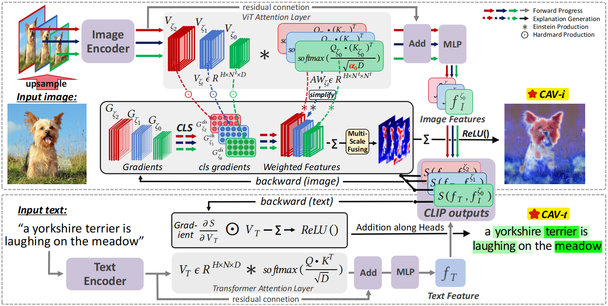

# Class Activation Values: Lucid and Faithful Visual Interpretations for CLIP-based Text-Image Retrievals

Pytorch implementation of **Class Activation Values: Lucid and Faithful Visual Interpretations for CLIP-based Text-Image Retrievals**, which is accepted by [SIGIR 2025](https://doi.org/10.1145/3726302.3729923 "link").
<p style="text-align: center">

</p>
 


## 😄 Pipeline of Class Activation Values:
<p style="text-align: center">

</p>


## 🔥 Intrepreting CLIP Text-Image Retrievals:
<p style="text-align: center">

</p>

## 🔥 Intrepreting CLIP Zero-Shot Classification:
<p style="text-align: center">

</p>

## 🛠️ Requirements
```
python 3.X
jupyter notebook
pytorch >= 1.5 (including torchvision)
matplotlib
opencv-python
No more other requirements
```

## 🗝️ How to Run

```
run demo.ipynb
```
## ✏️ Citation
```bibtex
@inproceedings{chen2025cav, 
   title={Class Activation Values: Lucid and Faithful Visual Interpretations for CLIP-based Text-Image Retrievals}, 
   author={Pengxu Chen and Huazhong Liu and Jihong Ding and Xinghao Huang and Shaojun Zou and Laurence T. Yang}, 
   booktitle={Proceeding of the ACM SIGIR International Conference on Research and Development in Information Retrieval}, 
   year={2025},
   pages={844-853},
   doi={10.1145/3726302.3729923}
}
```


Any questions can be asked at [chenpx@hainanu.edu.cn](mailto:chenpx@hainanu.edu.cn)

